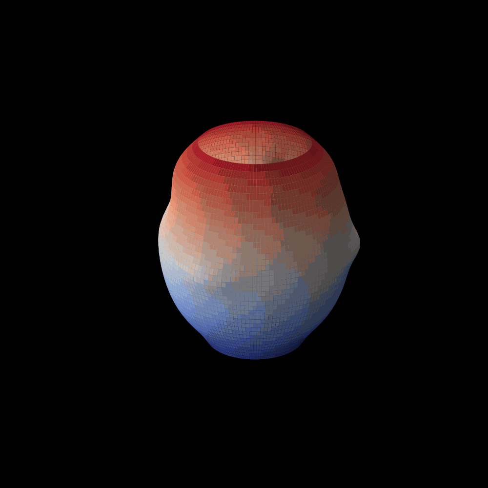

# Humanoid Holographic AI Face

Below is a 3D rotating holographic female face, generated using an advanced layered approach with polar coordinates and Gaussian–based feature modulation. The model is inspired by the golden ratio and complex facial morphologies, updated automatically via GitHub Actions.

